<div align="center">

# BetterEnd: New Dawn

**An independently maintained continuation of BetterEnd for modern Minecraft versions**

[](https://www.curseforge.com/minecraft/mc-mods/betterend-neoforge)
[](https://github.com/Reijin2312/BetterEnd-New-Dawn/issues)
[](https://www.curseforge.com/minecraft/mc-mods/betterend-neoforge/files)
[](https://www.curseforge.com/minecraft/mc-mods/betterend-neoforge)
[](LICENSE)

[CurseForge](https://www.curseforge.com/minecraft/mc-mods/betterend-neoforge)
·
[Downloads](https://www.curseforge.com/minecraft/mc-mods/betterend-neoforge/files)
·
[Issues](https://github.com/Reijin2312/BetterEnd-New-Dawn/issues)
·
[Discord](https://discord.gg/BHxhJSn5uR)

</div>

---

## About

**BetterEnd: New Dawn** is an independently maintained, unofficial continuation of BetterEnd for Fabric, Quilt, and NeoForge.

The project continues development of the original BetterEnd experience with maintenance, bug fixes, compatibility improvements, and support for newer Minecraft versions and mod loaders.

BetterEnd expands and refreshes The End with new biomes, plants, mobs, structures, resources, mechanics, music, sounds, visual effects, and a custom End world generator.

> [!IMPORTANT]
> BetterEnd: New Dawn is not maintained or endorsed by the original BetterEnd developers.
>
> Please do not report New Dawn-specific issues to the upstream BetterEnd repository or the official BetterX support channels. Use the [New Dawn issue tracker](https://github.com/Reijin2312/BetterEnd-New-Dawn/issues) instead.

---

## Supported versions

| Minecraft version | Mod loader     | Source branch                                                                          |
| ----------------- | -------------- | -------------------------------------------------------------------------------------- |
| 1.21.1            | NeoForge       | [`main`](https://github.com/Reijin2312/BetterEnd-New-Dawn/tree/main)                   |
| 1.21.1            | Fabric / Quilt | [`fabric-1.21.1`](https://github.com/Reijin2312/BetterEnd-New-Dawn/tree/fabric-1.21.1) |
| 1.21.11           | NeoForge       | [`port/1.21.11`](https://github.com/Reijin2312/BetterEnd-New-Dawn/tree/port/1.21.11)   |
| 26.1–26.1.2       | NeoForge       | [`26.1`](https://github.com/Reijin2312/BetterEnd-New-Dawn/tree/26.1)                   |

Always check the [CurseForge files page](https://www.curseforge.com/minecraft/mc-mods/betterend-neoforge/files) and download the correct file for your Minecraft version and mod loader.

---

## Features

* More than 24 End biomes, each with its own atmosphere, resources, vegetation, and ambience
* Six new mobs, including biome-specific variations
* Nine wood types and seven stone types
* New blocks, decorative materials, tools, armor, weapons, and food
* Infusion Rituals and custom anvil recipes
* Custom End tool and equipment progression
* Custom End world generation with configurable island shapes, terrain, heights, and caves
* Custom Central Island structures
* Music, sounds, particles, and visual effects
* Configurable blocks, items, mobs, enchantments, world generation, and other systems
* Integrations and compatibility improvements for other biome and world-generation mods

---

## Gallery

<table>
  <tr>
    <td width="50%">
      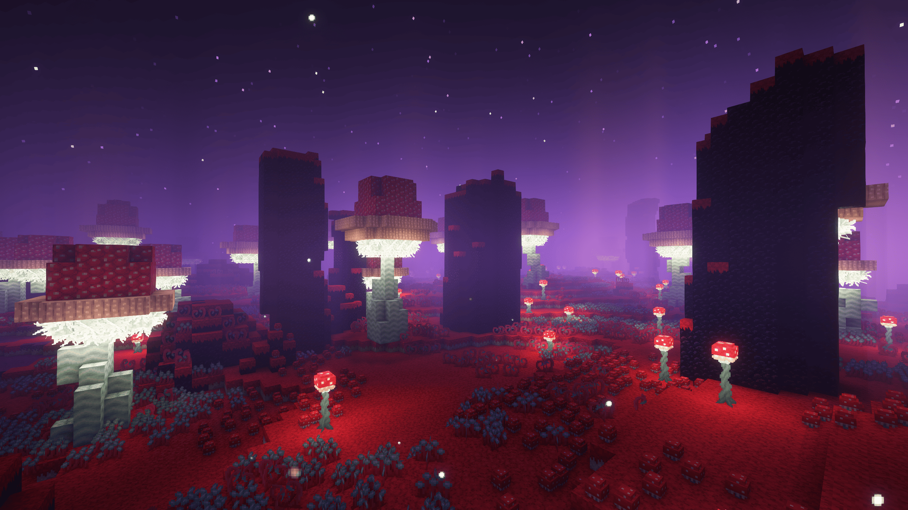
    </td>
    <td width="50%">
      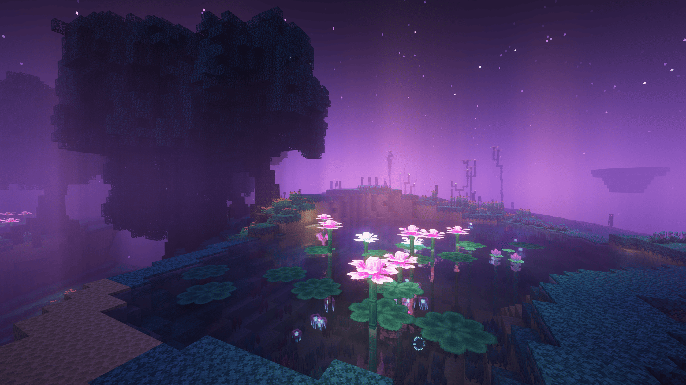
    </td>
  </tr>
  <tr>
    <td width="50%">
      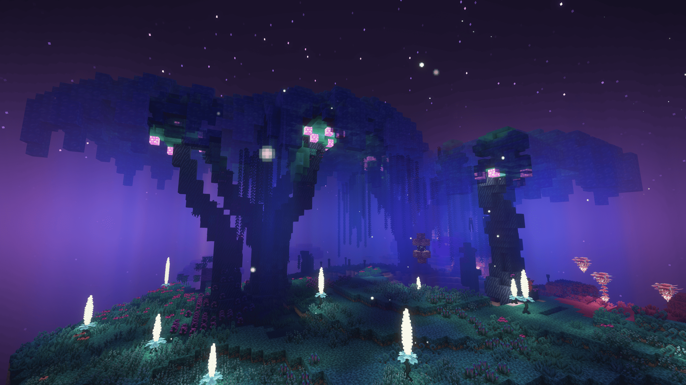
    </td>
    <td width="50%">
      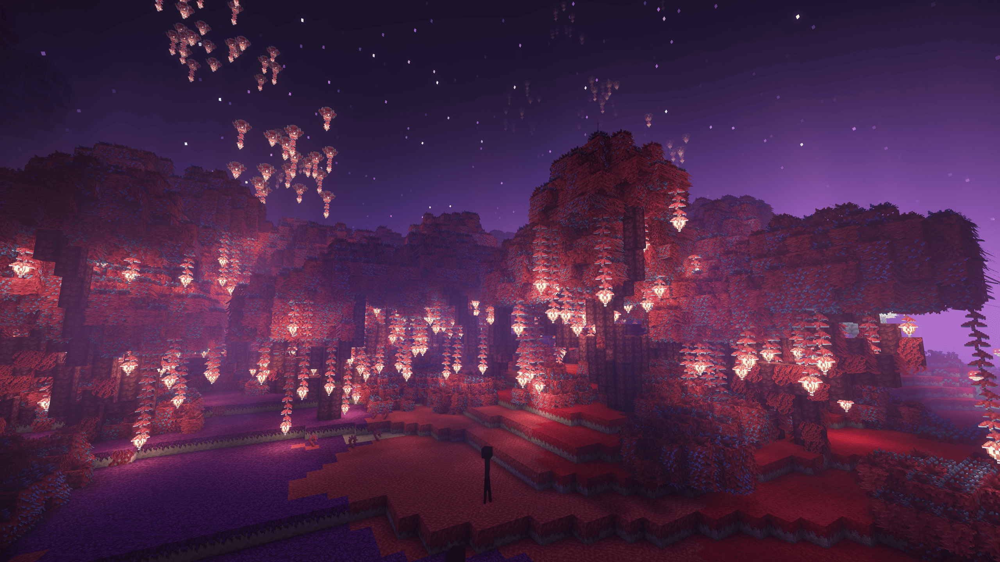
    </td>
  </tr>
</table>

<details>
<summary><b>View all screenshots</b></summary>

<br>

<table>
  <tr>
    <td width="50%">
      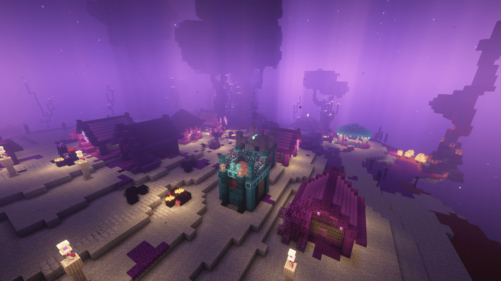
    </td>
    <td width="50%">
      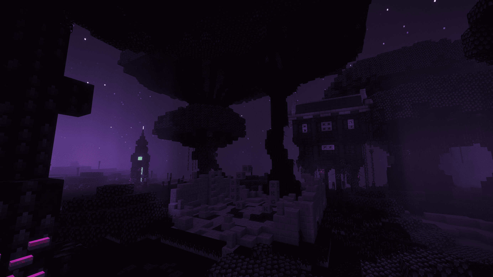
    </td>
  </tr>
  <tr>
    <td width="50%">
      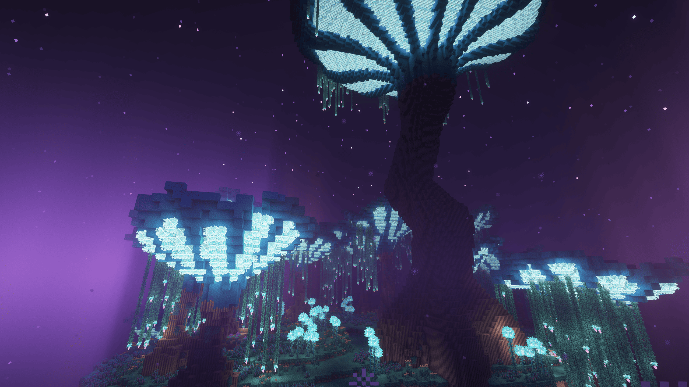
    </td>
    <td width="50%">
      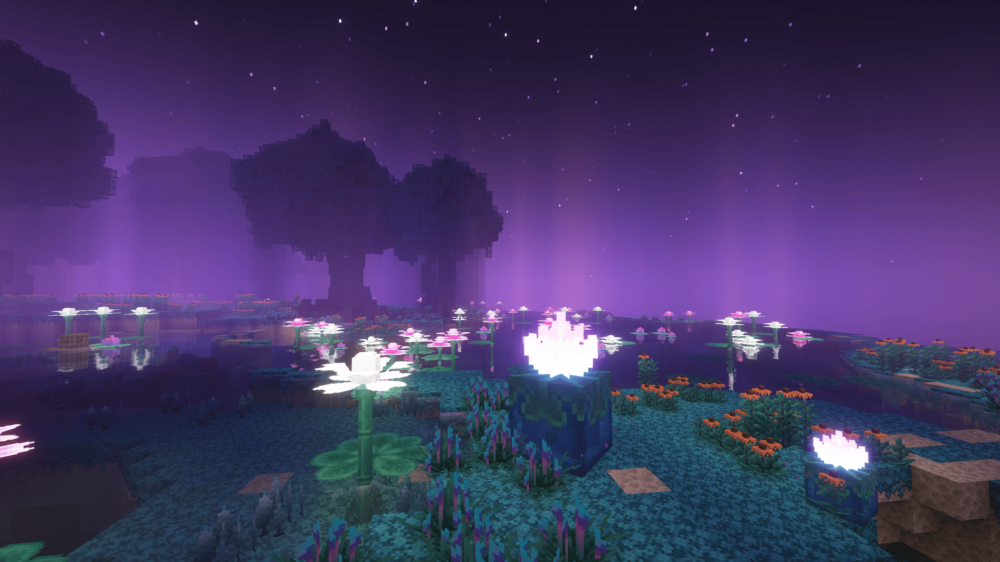
    </td>
  </tr>
  <tr>
    <td width="50%">
      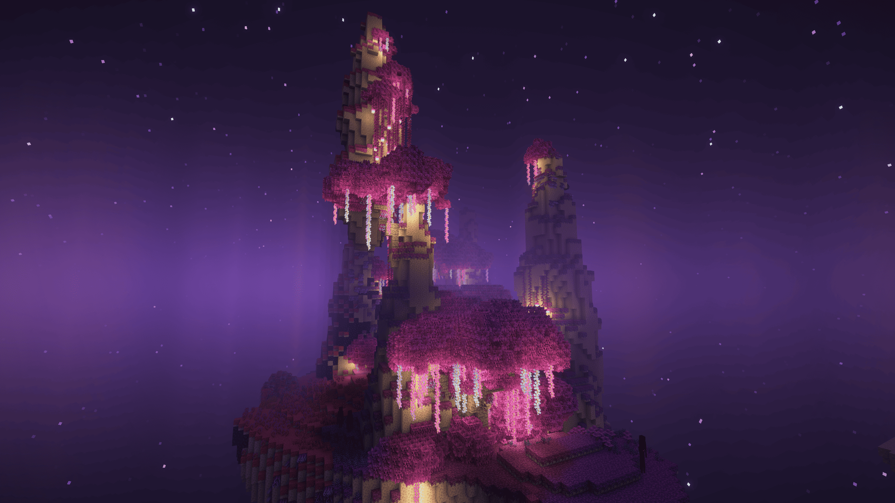
    </td>
    <td width="50%">
      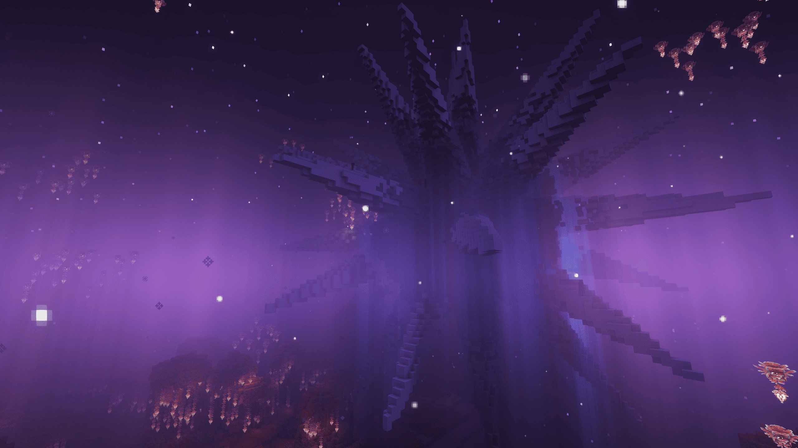
    </td>
  </tr>
  <tr>
    <td width="50%">
      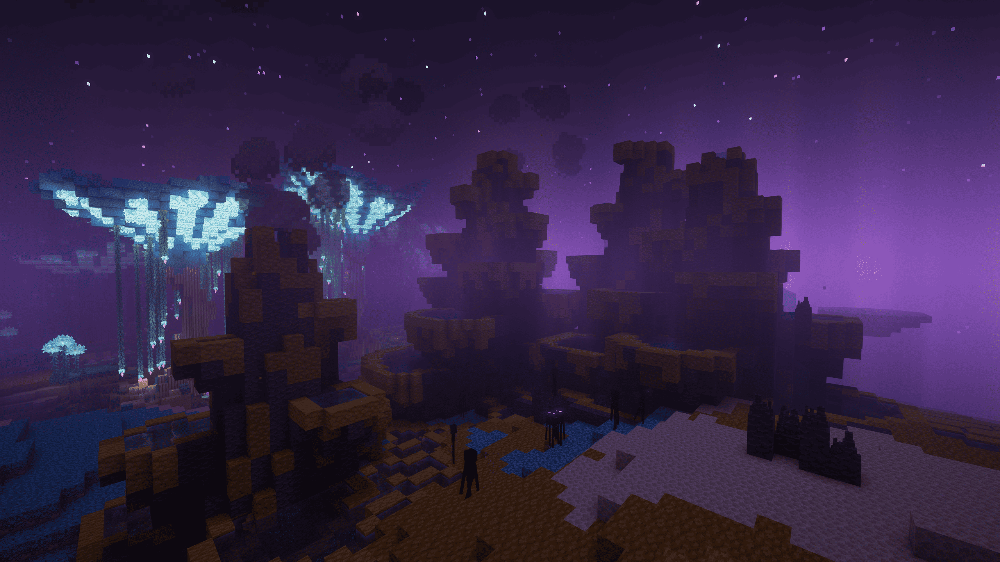
    </td>
    <td width="50%">
      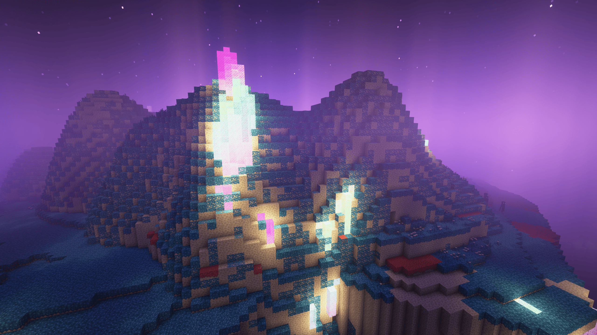
    </td>
  </tr>
  <tr>
    <td width="50%">
      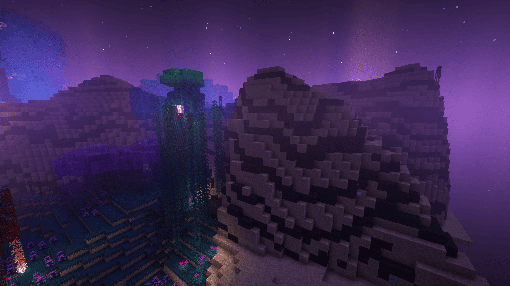
    </td>
    <td width="50%">
      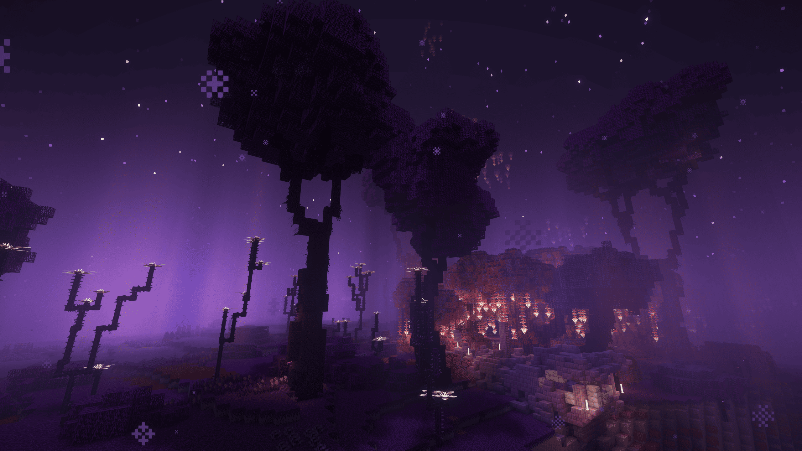
    </td>
  </tr>
  <tr>
    <td width="50%">
      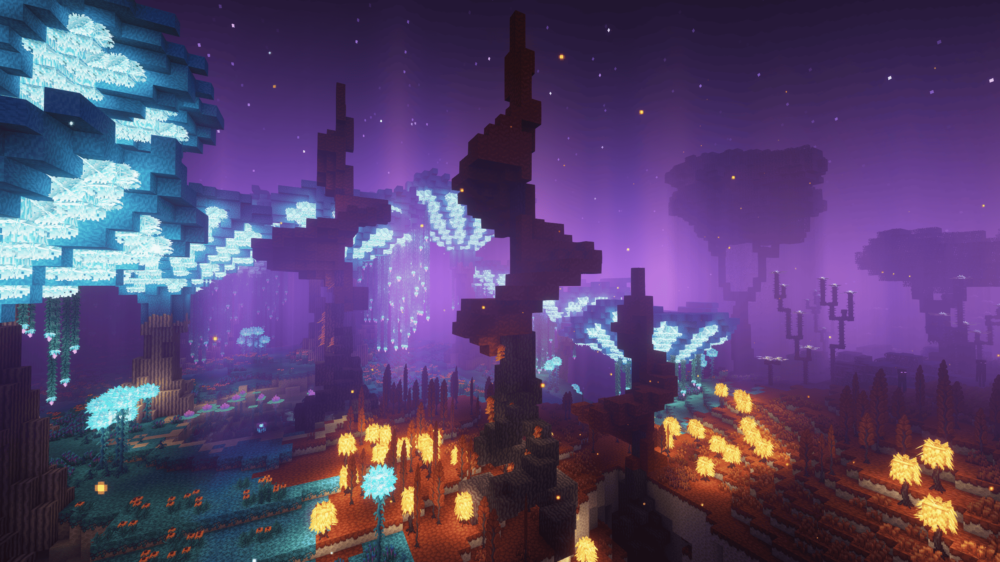
    </td>
    <td width="50%">
      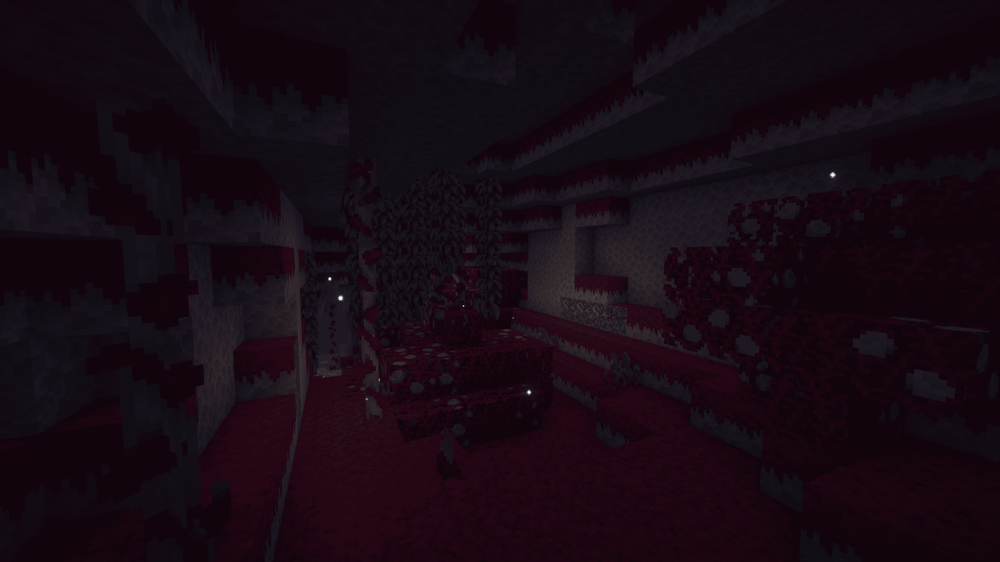
    </td>
  </tr>
</table>

</details>

---

## Download and installation

Download BetterEnd: New Dawn from the official CurseForge page:

### [Download from CurseForge](https://www.curseforge.com/minecraft/mc-mods/betterend-neoforge/files)

1. Install a supported Minecraft version.
2. Install the appropriate NeoForge, Fabric, or Quilt loader.
3. Download the BetterEnd: New Dawn file matching your loader and Minecraft version.
4. Install the required dependencies shown on the CurseForge file page.
5. Place the downloaded `.jar` files in your Minecraft `mods` directory.
6. Launch the game.

Make sure the Minecraft version, mod loader, BetterEnd version, and all dependencies match.

---

## Development setup

Clone the repository:

```bash
git clone https://github.com/Reijin2312/BetterEnd-New-Dawn.git
cd BetterEnd-New-Dawn
```

Select the branch for the version and loader you want to work on:

```bash
# NeoForge 1.21.1
git checkout main

# Fabric / Quilt 1.21.1
git checkout fabric-1.21.1

# NeoForge 1.21.11
git checkout port/1.21.11

# NeoForge 26.1.x
git checkout 26.1
```

Edit `gradle.properties` if necessary.

### IntelliJ IDEA

```bash
./gradlew genSources idea
```

### Eclipse

```bash
./gradlew genSources eclipse
```

Import the project into your IDE as a Gradle project.

On Windows, use `gradlew.bat` instead of `./gradlew` when necessary.

---

## Building

Run:

```bash
./gradlew build
```

The compiled mod files will be available in:

```text
build/libs
```

---

## Reporting issues

Before opening an issue:

1. Make sure you are using the latest available version.
2. Verify that you downloaded the correct file for your Minecraft version and loader.
3. Check that all required dependencies are installed.
4. Test without unrelated mods when possible.
5. Include the latest log or crash report.
6. Include a complete mod list and steps to reproduce the problem.

Report bugs through the official New Dawn issue tracker:

### [Open an issue](https://github.com/Reijin2312/BetterEnd-New-Dawn/issues)

---

## Contributing

Contributions are welcome.

You can help by:

* reporting and reproducing bugs;
* submitting fixes and compatibility improvements;
* testing new releases;
* improving performance;
* updating translations;
* improving documentation.

Please clearly explain your changes and test them before submitting a pull request.

---

## Maintainer

BetterEnd: New Dawn is maintained by **Raijin**.

* [CurseForge profile: Raijin2312](https://www.curseforge.com/members/raijin2312/projects)
* [GitHub profile: Reijin2312](https://github.com/Reijin2312)
* [New Dawn Discord](https://discord.gg/BHxhJSn5uR)

---

## Credits and attribution

* BetterEnd was originally created by **Paulev** and its contributors.
* The upstream BetterEnd source is maintained at [`quiqueck/BetterEnd`](https://github.com/quiqueck/BetterEnd).
* The original BetterEnd project is available on [CurseForge](https://www.curseforge.com/minecraft/mc-mods/betterend).
* BetterEnd: New Dawn is an independent, unofficial continuation maintained by Raijin.
* Special thanks to everyone who reports issues, contributes fixes, creates translations, and tests releases.

---

## License

The project source code is distributed under the [MIT License](LICENSE).

Copyright:

* © 2020 paulevsGitch
* © 2026 Raijin

Selected project assets are distributed under the terms described in [`LICENSE.ASSETS`](LICENSE.ASSETS). Those assets use the **CC BY-NC-SA 4.0** license and require attribution to **Team BetterX**.

See both license files before redistributing the project or its assets.
